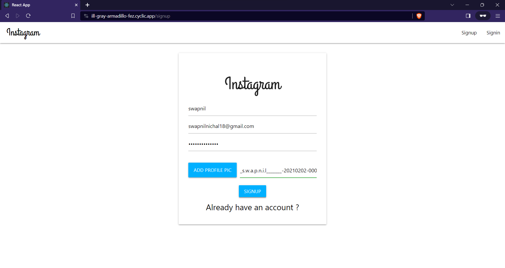
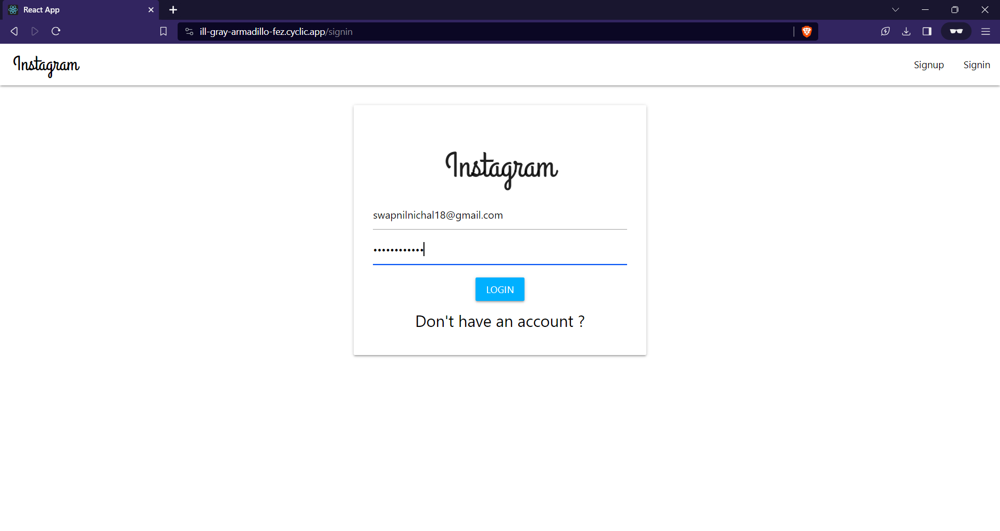
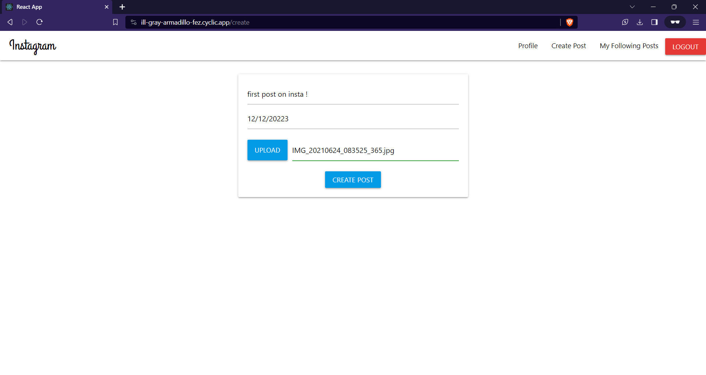
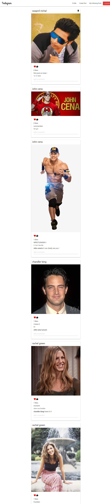

# Instagram Clone

## Description
A simplified version of Instagram, built for learning purposes.

## Technologies Used
- React
- Node.js
- Express
- MongoDB
- Materealize css
- Cloudinary

## Features
- User authentication
  1) This app allows users to register, log in and log out.
  2) User can reset there password using email.
- Data related to User and their post related actions are stored in database.
  1) User related data - user name,email, hashed password.
  2) Post related data - postid, image URL, caption, comments, likes
- User Profile
  1) User can upload there profile picture.
  2) User can see their own profile page as well as other Users profile page.
- User can do following things.
  1) User can upload their picture with caption.
  2) User can follow or unfollow other Users.
  3) User can like the posts.
  4) user can comment on posts.
  5) user can delete there own posts.
- Filter  
  1) User can see the post related to there following only by filtering option.

## Screenshots
<h3>Sign Up Functionality ➡️</h3>

<h3>Log In Functionality ➡️</h3>

<h3>Picture Upload ( Post ) Functionality ➡️</h3>

<h3>Entire View of Instagram Clone ➡️</h3>

<h1>Thank You! 🥳</h1>

